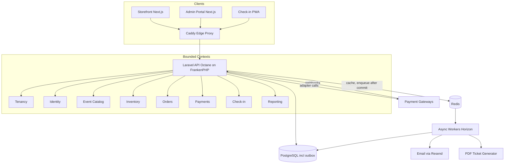
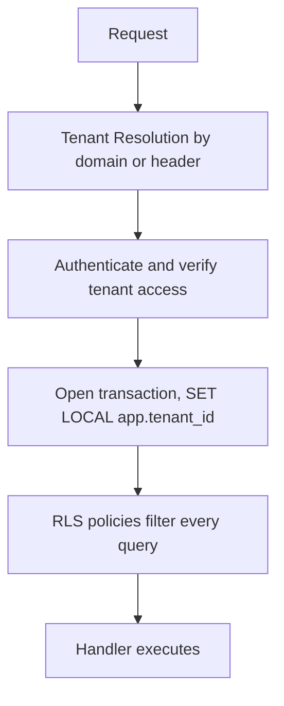
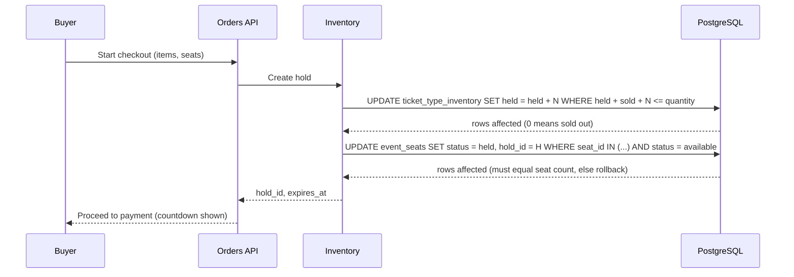
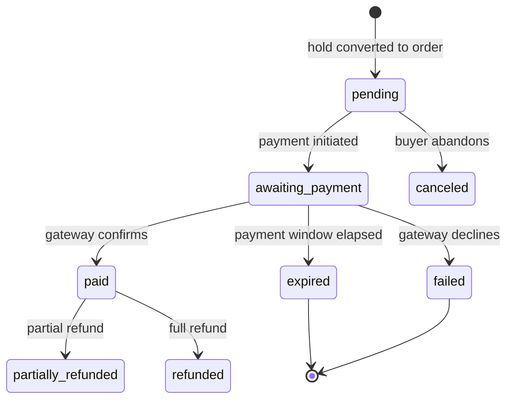
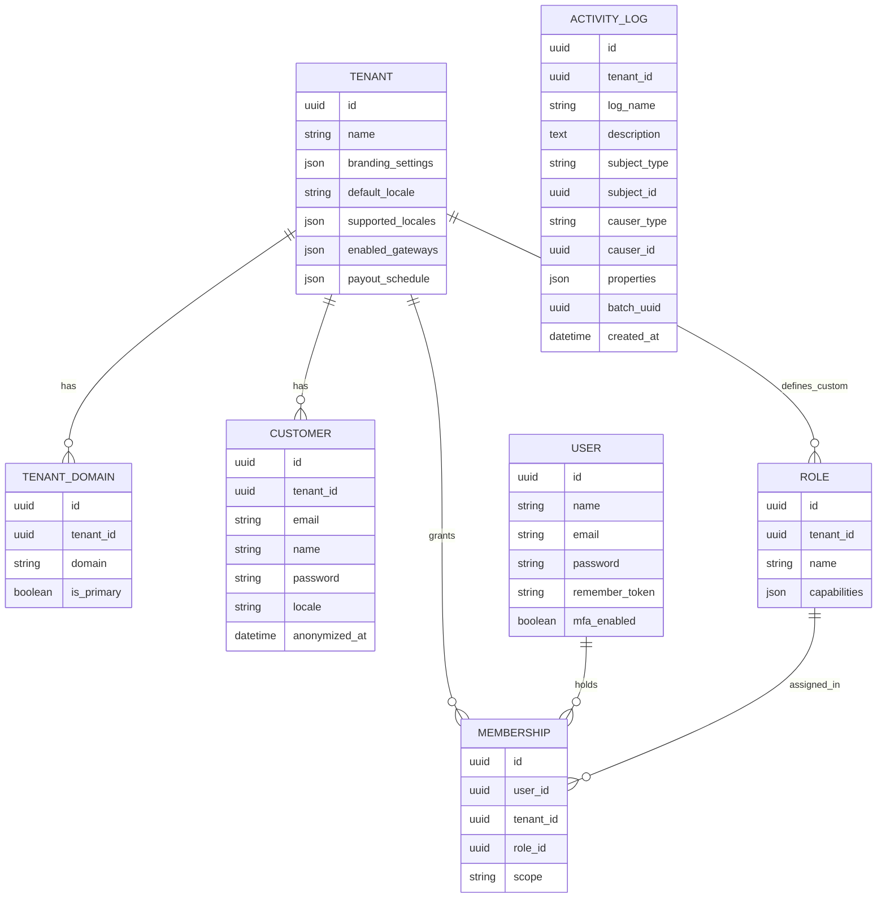
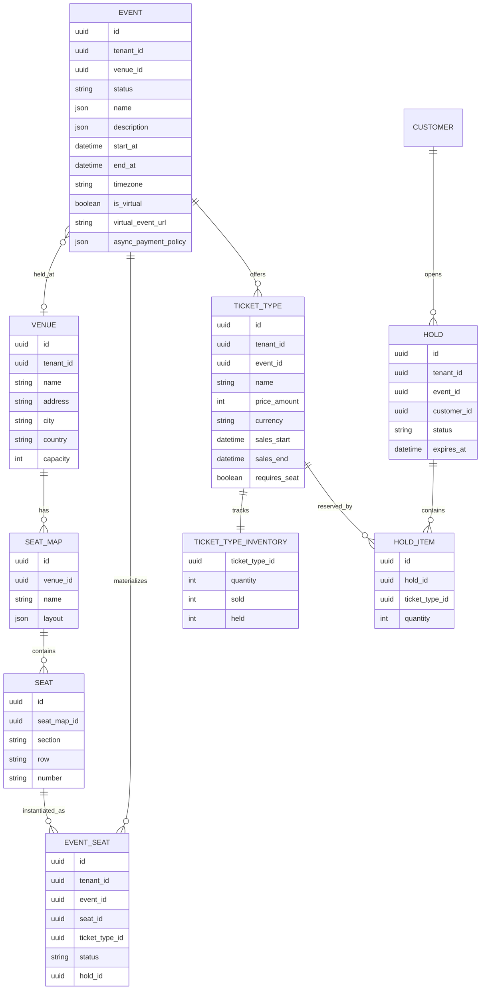
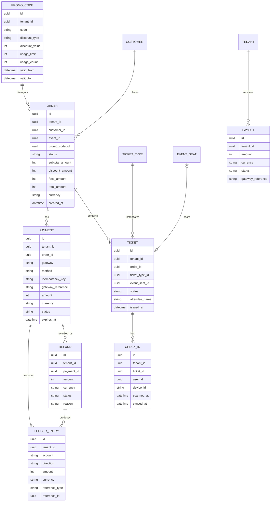
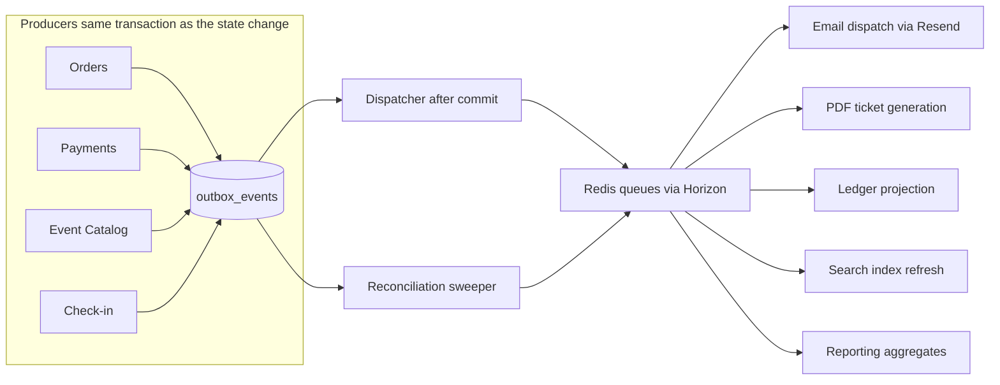
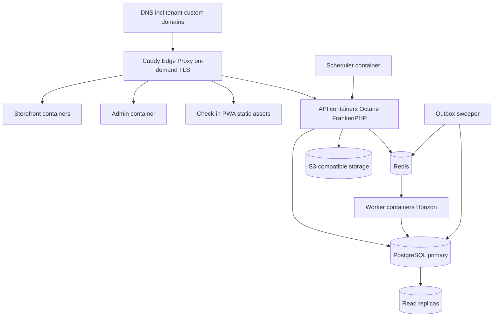

# Nodia System Design Document

## 1. Executive Summary

This document describes the system architecture for Nodia, a white-label, multi-tenant SaaS platform for event management. The platform enables tenants to create and manage events, sell tickets, and receive payouts, while providing attendees with a reliable purchasing experience. The design prioritizes the problems that make or break ticketing platforms: inventory correctness under concurrency, money flow to tenants, asynchronous payment methods, and enforceable tenant isolation.

Key features:

- Multi-tenant architecture with custom domains and branding
- Event and ticket management with general admission and reserved seating
- Payment processing through tenant-selected gateways, with the platform as merchant of record
- Overselling-proof inventory with time-limited reservations
- Promotional codes
- Check-in management through a dedicated offline-first PWA
- Virtual event support
- Multi-language storefronts
- Reporting and analytics

## 2. Key Architectural Decisions

Each decision is recorded as an ADR in [`docs/decisions/`](decisions/) using the MADR minimal format.

| Decision               | Choice                                                                                                                               | ADR                                                                                             |
| ---------------------- | ------------------------------------------------------------------------------------------------------------------------------------ | ----------------------------------------------------------------------------------------------- |
| Backend shape          | Single Laravel application (modular monolith), organized by bounded contexts with Laravel-native internals, API only                 | [002](decisions/002-laravel-modular-monolith-with-bounded-contexts.md)                          |
| Runtime                | Laravel Octane on FrankenPHP, official FrankenPHP Docker image                                                                       | [009](decisions/009-octane-on-frankenphp.md)                                                    |
| Frontend               | React with Next.js (storefront and admin portal); separate offline-first check-in PWA                                                | [016](decisions/016-nextjs-monorepo-frontends.md), [015](decisions/015-separate-checkin-pwa.md) |
| Repository             | Monorepo containing the API and frontend projects                                                                                    | [016](decisions/016-nextjs-monorepo-frontends.md)                                               |
| Async processing       | Transactional outbox in PostgreSQL as the durable event log; Redis (Laravel Horizon) queues for delivery; sweeper reconciles the two | [004](decisions/004-transactional-outbox-with-redis-queues.md)                                  |
| Database               | PostgreSQL with row-level security for tenant isolation                                                                              | [003](decisions/003-postgres-rls-for-tenant-isolation.md)                                       |
| Card data              | Never stored; tokenization via gateway-hosted fields (PCI SAQ-A scope)                                                               | [006](decisions/006-merchant-of-record-with-submerchant-gateways.md)                            |
| Gateway selection      | Tenants enable any gateway the platform provides an adapter for; no region restriction                                               | [008](decisions/008-tenant-selected-gateways-no-regions.md)                                     |
| Identity               | Staff on the default Laravel `users` table with multi-tenant memberships; customers tenant-scoped in their own table                 | [007](decisions/007-staff-on-default-users-table-customers-separate.md)                         |
| Roles                  | Custom RBAC: global role templates plus per-tenant custom roles, evaluated through Gates and Policies                                | [012](decisions/012-custom-rbac-over-laravel-permission.md)                                     |
| Authentication         | OAuth 2.0 via Laravel Passport, JWT access tokens                                                                                    | [011](decisions/011-passport-oauth2-for-authentication.md)                                      |
| DTOs and contracts     | spatie/laravel-data objects as the source of truth for API shapes                                                                    | [013](decisions/013-laravel-data-for-dtos.md)                                                   |
| Cross-cutting packages | spatie medialibrary, activitylog, translatable, query-builder for commodity concerns                                                 | [014](decisions/014-spatie-utility-packages.md)                                                 |
| Email                  | Resend via the official Laravel driver                                                                                               | [010](decisions/010-resend-for-transactional-email.md)                                          |
| Deployment             | OCI container images as the artifact; orchestrator chosen before production, not now                                                 | [017](decisions/017-containers-first-defer-orchestrator.md)                                     |
| Identifiers            | UUIDv7 primary keys; no sequential IDs exposed externally                                                                            | [005](decisions/005-uuidv7-identifiers.md)                                                      |
| Money                  | Integer minor units (cents) with an explicit currency on every monetary record                                                       | [018](decisions/018-integer-minor-units-for-money.md)                                           |

The implementation roadmap is tracked outside this document.

## 3. Architecture Overview

The backend is a single deployable Laravel application organized into bounded contexts, served by Octane on FrankenPHP. Contexts communicate in-process through Actions for synchronous needs and through domain events for side effects. Domain events are persisted to a transactional outbox in PostgreSQL and delivered as Redis-backed queue jobs to async consumers (workers of the same codebase running Horizon).



### 3.1 Bounded Contexts

- **Tenancy**: tenant lifecycle, domains, branding, locale configuration, gateway configuration.
- **Identity**: users, memberships, roles, permissions, customer accounts, authentication.
- **Event Catalog**: events, venues, seat maps, ticket types, categories, translations, search.
- **Inventory**: quantity accounting, holds, seat allocation. Owns the invariant that nothing is ever oversold.
- **Orders**: checkout, order state machine, promo codes, tickets.
- **Payments**: gateway adapters, payment and refund records, webhook ingestion, ledger, payouts.
- **Check-in**: ticket validation, device sync, offline reconciliation.
- **Reporting**: aggregates, exports, dashboards.

Contexts keep hard boundaries but Laravel-native internals: Eloquent models used directly, single-purpose Action classes as the use-case layer, form requests for validation, policies for authorization, jobs for async consumers, and laravel-data objects as the DTOs that cross context and API boundaries. There is no repository or Domain/Application/Infrastructure layering; the framework's conventions are the architecture inside a context.

The boundary rule: a context may invoke another context's Actions (passing and receiving Data objects) and may subscribe to its domain events. It never imports another context's Models or queries its tables. Architecture tests enforce this (section 18).

### 3.2 Directory Structure

The API application follows the standard Laravel skeleton, with one folder per bounded context under `app/`. Migrations, factories, and seeders stay in the conventional central `database/` directory. Each context ships a service provider that registers its routes, event subscriptions, and policies.

```
apps/api/
  app/
    Models/
      User.php                    Default Laravel user model (staff identity)
    Providers/
      AppServiceProvider.php
    Support/
      Outbox/                     Shared outbox infrastructure: OutboxEvent model, dispatcher, delivery tracking, sweeper
      Money/                      Minor-unit money value object and Eloquent casts
    Tenancy/
      Models/                     Tenant, TenantDomain
      Actions/                    CreateTenant, RegisterDomain, UpdateBranding, ConfigureGateways
      Events/                     TenantCreated, DomainVerified
      Http/
        Controllers/
        Requests/
        Resources/
      Policies/
      Data/
      TenancyServiceProvider.php
    Identity/
      Models/                     Membership, Role, Customer
      Actions/                    InviteUser, AssignRole, RegisterCustomer, ClaimGuestAccount, AnonymizeCustomer
      Events/                     UserInvited, UserRoleChanged, CustomerRegistered
      Http/
        Controllers/
        Requests/
        Resources/
      Policies/
      Data/
      IdentityServiceProvider.php
    EventCatalog/
      Models/                     Event, Venue, SeatMap, Seat, TicketType
      Actions/                    CreateEvent, PublishEvent, CancelEvent, UpsertSeatMap
      Events/                     EventCreated, EventUpdated, EventPublished, EventCanceled
      Jobs/                       RefreshSearchIndex
      Http/
        Controllers/
        Requests/
        Resources/
      Policies/
      Data/
      EventCatalogServiceProvider.php
    Inventory/
      Models/                     TicketTypeInventory, EventSeat, Hold, HoldItem
      Actions/                    CreateHold, ExtendHold, ReleaseHold, CommitHold, MaterializeEventSeats
      Events/                     HoldCreated, HoldExpired, HoldReleased
      Console/                    ReleaseExpiredHolds (scheduled sweeper)
      Http/
        Controllers/
        Requests/
        Resources/
      Data/
      InventoryServiceProvider.php
    Orders/
      Models/                     Order, Ticket, PromoCode
      Actions/                    ConvertHoldToOrder, CancelOrder, IssueTickets, ApplyPromoCode
      Events/                     OrderCreated, TicketIssued, TicketCanceled, TicketRefunded
      Jobs/                       SendOrderConfirmation, GenerateTicketPdf
      Http/
        Controllers/
        Requests/
        Resources/
      Policies/
      Data/
      OrdersServiceProvider.php
    Payments/
      Models/                     Payment, Refund, LedgerEntry, Payout
      Gateways/                   GatewayAdapter interface plus one adapter per gateway
      Actions/                    InitiatePayment, ConfirmPayment, ExecuteRefund, IngestWebhook
      Events/                     PaymentInitiated, PaymentConfirmed, PaymentFailed, RefundInitiated, RefundCompleted, PayoutExecuted
      Jobs/                       ProjectLedgerEntries, ProcessGatewayWebhook
      Console/                    ReconcilePendingPayments (scheduled poller)
      Http/
        Controllers/              Includes one webhook controller per gateway
        Requests/
        Resources/
      Policies/
      Data/
      PaymentsServiceProvider.php
    CheckIn/
      Models/                     CheckIn
      Actions/                    BuildManifest, RecordScan, ReconcileOfflineScans
      Events/                     TicketCheckedIn, DuplicateScanDetected
      Http/
        Controllers/
        Requests/
        Resources/
      Policies/
      Data/
      CheckInServiceProvider.php
    Reporting/
      Models/                     Read models (pre-aggregated projections)
      Actions/                    BuildExport
      Jobs/                       Projectors per subscribed event type
      Http/
        Controllers/
        Resources/
      Policies/
      ReportingServiceProvider.php
  bootstrap/
  config/
  database/
    migrations/
    factories/
    seeders/
  routes/
    api.php                       Versioned under /v1; contexts register route groups via their providers
  tests/
    Feature/                      One folder per context
    Unit/                         One folder per context
    Architecture/                 Boundary enforcement tests
```

## 4. Multi-Tenant Architecture

Shared database, shared schema, with `tenant_id` on every tenant-scoped table and PostgreSQL row-level security as the enforcement mechanism. Application-level scoping (global Eloquent scopes) is a convenience; RLS is the guarantee.



### 4.1 Tenant Resolution

- Storefront requests resolve the tenant from the `Host` header against `tenant_domains` (custom domains and platform subdomains).
- Admin API requests resolve the tenant from the authenticated membership plus an explicit tenant selector, never from client-supplied IDs alone.
- Every request handler runs inside a transaction where `SET LOCAL app.tenant_id` has been executed; RLS policies on all tenant-scoped tables compare `tenant_id` to that setting. Because Octane reuses workers across requests, tenant state is never kept in static or singleton state; it lives in the request-scoped container and the transaction-local setting only.

### 4.2 Denormalized tenant_id

`tenant_id` is present and non-null on every tenant-scoped table, including `orders`, `tickets`, `ticket_types`, `payments`, and `check_ins`, even where it is derivable through joins. This keeps RLS policies simple and single-table and makes future sharding by tenant possible.

### 4.3 Cross-Tenant Operations

Platform administration (support, billing, aggregate analytics) uses a separate database role for which RLS policies allow cross-tenant reads. This role is only assumable by platform-scope staff, and every use is recorded in the activity log.

## 5. Identity Model

Two distinct identity populations with different lifecycles, credentials, and data-protection treatment. They are separate models, not one table with a type flag.

### 5.1 Users

Employees of tenants (and of the platform itself). Staff are the default Laravel `users` table and `App\Models\User` model, following framework conventions (`password`, `remember_token`, timestamps). A user is a platform-level identity that gains access to tenants through memberships:

- `users`: global identity (email unique platform-wide), credentials, MFA settings.
- `memberships`: links a user to a tenant with a role. One person can administer multiple tenants (agencies, businesses operating several brands) with a single login.
- Platform administrators are users with a platform-scope membership instead of a tenant membership.

Staff authenticate against the admin portal and the check-in PWA. MFA is mandatory for platform-scope staff and for tenant roles that include payout or refund permissions.

### 5.2 Customers

Attendees who buy tickets. Customers are tenant-scoped: the same email address can hold independent accounts under different tenants, which is what white-labeling implies (the attendee has a relationship with the tenant's brand, not with the platform).

- `customers`: `tenant_id` plus email, unique per tenant. Password is nullable to support guest checkout; a guest record can later be claimed by setting credentials via email verification.
- Customers never gain administrative permissions and never appear in the staff permission system.

### 5.3 Roles and Permissions

Custom RBAC tables, evaluated through Laravel Gates and Policies. spatie/laravel-permission was evaluated and rejected: without its teams feature, role assignments are global per user and cannot be scoped to a tenant membership (ADR [012](decisions/012-custom-rbac-over-laravel-permission.md)).

- `roles` with a nullable `tenant_id`: null means a global template role maintained by the platform (Owner, Event Manager, Box Office, Finance, Check-in Agent); a set `tenant_id` means a custom role defined by that tenant.
- Permissions are a flat set of named capabilities (e.g. `events.publish`, `orders.refund`, `payouts.view`) stored per role. Tenants create custom roles by composing capabilities; they cannot edit global templates.
- Authorization checks always evaluate capability plus tenant context, never role names. Policies resolve the acting membership's role and check the capability set.

### 5.4 Authentication

- OAuth 2.0 (Laravel Passport) issuing short-lived JWT access tokens and rotating refresh tokens.
- Tokens carry the identity type (staff or customer), the subject ID, and for customers the tenant ID. Staff tokens carry no implicit tenant; the acting tenant is asserted per request and validated against memberships.
- Session controls: refresh token rotation with reuse detection, server-side revocation list, configurable idle timeout for the admin portal.

## 6. Inventory and Reservations

The core invariant: for every ticket type, `sold + held <= quantity`; for every seat of an event, at most one active hold or ticket. This section is the design's center of gravity because concurrent checkout is where ticketing systems fail.

### 6.1 Holds

A hold is a short-lived reservation created when a buyer begins checkout, covering specific quantities per ticket type and, for reserved seating, specific seats.



- Concurrency control is a single atomic conditional `UPDATE` per ticket type against an inventory counter row, and a conditional status transition per seat. No row is ever oversold because the condition is evaluated inside the same statement that mutates it. Redis is used for read-side availability display, never as the source of truth.
- Default hold TTL: 10 minutes, extended automatically while an initiated payment is pending (see 7.4).
- Expiry is enforced by a scheduled sweeper command that releases expired holds (decrements `held`, frees seats) and by checkout-time validation; a hold past `expires_at` cannot be converted to an order even if the sweeper is behind.

### 6.2 Reserved Seating

- Seat maps are defined per venue as reusable templates (`seat_maps`, `seats` with section, row, number and layout coordinates).
- Publishing an event with reserved seating materializes `event_seats`: one row per sellable seat per event, carrying status (`available`, `held`, `sold`, `blocked`). A unique constraint on `(event_id, seat_id)` plus the conditional status transitions make double-booking structurally impossible.
- Tenants can reconfigure a materialized map per event (block seats, change ticket type zoning) without touching the venue template.

### 6.3 General Admission

GA ticket types use the counter row only (`quantity`, `sold`, `held`). The counter lives in its own narrow table (`ticket_type_inventory`) so hot updates during on-sales do not contend with reads of ticket type metadata.

## 7. Checkout and Payments

### 7.1 Order State Machine



Tickets are issued (rows created, barcodes generated, PDF and email dispatched via domain events) only on the transition to `paid`. Inventory moves from `held` to `sold` in the same transaction as that transition; on `expired`, `failed`, or `canceled`, the hold is released.

### 7.2 Gateway Selection

The platform maintains a set of gateway adapters; tenants enable any subset of them. There is no region restriction: a tenant may use any available gateway whose capabilities fit its needs.

- Each tenant has a set of enabled gateway configurations chosen from the platform's available adapters.
- The Payments context holds one adapter per gateway behind a common interface: `createPayment`, `capture`, `refund`, `parseWebhook`, plus capability flags (supported methods, supported currencies, async confirmation, split support). Capability flags, not routing rules, express what each gateway can do; a gateway is offered at checkout only if it supports the order's currency.
- At checkout, the buyer sees the union of payment methods offered by the tenant's enabled gateways. Method choice selects the adapter.

### 7.3 Merchant of Record and Money Flow

The platform is the merchant of record. All chosen gateways must support marketplace or split-payment operation (sub-merchant onboarding), such as Stripe Connect, Adyen for Platforms, Pagar.me, or Mercado Pago marketplace mode.

- Tenants onboard as sub-merchants through the gateway's KYC flow; the platform never handles KYC documents directly.
- Every `paid` order produces double-entry ledger entries: gross charge, gateway fee, platform commission, tenant net. The ledger (`ledger_entries`) is append-only and is the source of truth for balances.
- Payouts to tenants are executed by the gateway on a per-tenant schedule; `payouts` records mirror gateway payout objects and reconcile against ledger balances.
- Refunds debit the tenant balance; commission handling on refunds is a per-tenant policy flag (returned or retained).

### 7.4 Asynchronous Payment Methods

Card payments confirm synchronously; Pix and boleto (Brazil) and some EU bank methods confirm asynchronously. The design treats async confirmation as the norm:

- Initiating a payment moves the order to `awaiting_payment` and extends the inventory hold to the payment method's expiration window (Pix: typically 30 minutes; boleto: up to 3 days).
- Confirmation arrives via gateway webhooks: a dedicated ingestion endpoint per gateway verifies the signature, persists the raw event, and enqueues a normalized `PaymentConfirmed` or `PaymentFailed` for the order state machine. Webhook processing is idempotent by gateway event ID.
- Because a boleto hold locks inventory for days, slow methods are configurable per event; tenants disable them for high-demand on-sales and the platform disables them automatically when remaining inventory drops below a threshold.
- A scheduled poller reconciles `awaiting_payment` orders against the gateway as a fallback for missed webhooks.

### 7.5 Card Data and PCI Scope

Card data is never stored, transmitted through, or rendered by platform systems. Checkout uses gateway-hosted fields or redirect flows; the platform stores only opaque gateway tokens, last-four digits, and brand for display. Target compliance scope is PCI DSS SAQ-A. The `payments` table stores an `idempotency_key` (generated per payment attempt) that is passed to the gateway on creation and on any retry, making retries safe against double charges.

### 7.6 Failure Handling at Checkout

The buyer-facing purchase path fails fast: a declined or errored synchronous payment returns immediately with the hold intact so the buyer can retry with another method until the hold expires. Automatic retries with backoff apply only to non-interactive operations (webhook processing, reconciliation, refund execution). Dead letter queues are for async consumers, never for the interactive path.

## 8. Data Model

Conventions: standard Eloquent conventions (snake_case plural tables, `created_at` and `updated_at` timestamps, conventional foreign key names) with UUIDv7 primary keys everywhere; `tenant_id` non-null on all tenant-scoped tables; monetary values as integer minor units paired with a `currency` code; timestamps in UTC with event-level timezones stored separately. The model is presented in three views; `tenant_id` foreign keys apply throughout even where the tenant relationships are not drawn, and timestamps are omitted from the diagrams.

### 8.1 Tenancy and Identity



`ACTIVITY_LOG` is spatie/laravel-activitylog's table with its published migration adjusted for UUID keys and an added non-null `tenant_id` under RLS (platform-scope entries use a sentinel platform tenant). Tenant branding assets and other file attachments live in spatie/laravel-medialibrary's polymorphic `media` table, not drawn here.

### 8.2 Catalog and Inventory



`EVENT.name` and `EVENT.description` are spatie/laravel-translatable JSON columns keyed by locale (section 12); there is no separate translations table. Event images and other attachments are medialibrary `media` records.

### 8.3 Orders and Money



Notes:

- `EVENT.venue_id` is nullable; virtual events have no venue. An application invariant requires exactly one of venue or `virtual_event_url` depending on `is_virtual`.
- `ORDER.promo_code_id` is a foreign key; `usage_count` is incremented atomically with the same conditional-update pattern as inventory, so `usage_limit` cannot be exceeded under concurrency.
- Ticket barcodes are not stored as static secrets. Each ticket's QR payload is a signed token (HMAC over ticket ID, event ID, and a rotation counter) generated on render; validation verifies the signature and looks up ticket status. Screenshots of old QR codes can be invalidated by bumping the rotation counter.
- `STAFF_USER` and `STAFF_MEMBERSHIP` from the previous revision are replaced by `USER` (the default Laravel table) and `MEMBERSHIP`; `CHECK_IN.staff_user_id` is now `user_id`. Customers have no role rows at all.

## 9. Domain Events and Async Processing

### 9.1 Transactional Outbox as Event Log

Every domain event is written to an append-only `outbox_events` table (monotonic sequence number, event ID, type, tenant ID, aggregate reference, payload, correlation ID) in the same transaction as the state change that caused it. The outbox is the durable source of truth for domain events. Rows are retained after dispatch rather than deleted, so the table doubles as the replay log: projections (ledger, reporting aggregates, search index) are rebuilt by rescanning it in sequence order. Old rows are archived to object storage on a retention schedule independent of delivery state.

The sequence is assigned at insert, so gaps are permanent and a lower sequence can commit after a higher one. Replay and ordered consumers never treat the sequence as gapless; the sweeper and projections read past a stability window (rows older than a short grace period) rather than assuming the highest sequence seen is final.

The outbox machinery (event model, dispatcher, delivery tracking, sweeper) is shared infrastructure in `app/Support/Outbox`; each context's `Events/` classes are the payloads it records.

### 9.2 Delivery via Redis Queues

Delivery is Laravel Horizon jobs on Redis. Redis is the delivery mechanism only, never the system of record.



- After the producing transaction commits, a dispatcher enqueues one job per subscriber. Jobs carry only the event ID; consumers load the payload from the outbox row. Subscriptions are static routing in code: TicketIssued feeds email dispatch, PDF generation, and reporting; PaymentConfirmed and RefundCompleted feed the ledger projection and reporting; catalog events feed the search index; check-in events feed reporting.
- An `outbox_deliveries` row per event and subscriber tracks progress (`pending`, `processed`). Consumers mark completion there and are idempotent by event ID, so duplicate delivery is harmless.
- The reconciliation sweeper re-enqueues deliveries still `pending` past a grace window. This covers every loss mode of the fast path: a crash between commit and enqueue, Redis data loss, a worker dying mid-job.
- Jobs that exhaust Horizon's backoff schedule land in the failed-jobs table, which is the dead letter queue: accumulation pages, and failed jobs are replayable after fixes.
- Horizon workers are concurrent and provide no ordering guarantee. Consumers that require order (the ledger projection) apply events per aggregate in outbox sequence order, deferring an event until its predecessors are processed.
- Every event carries a correlation ID originating from the initial HTTP request, propagated into logs and traces. Nothing user-interactive ever waits on the async pipeline.

Should an extracted service or throughput ever demand a dedicated broker, the outbox and the event contracts below are the seam: a relay from the outbox to Kafka can replace the dispatcher without touching producers or consumers.

### 9.3 Event Types

1. **Identity**: UserInvited, UserRoleChanged, CustomerRegistered
2. **Catalog**: EventCreated, EventUpdated, EventPublished, EventCanceled
3. **Inventory**: HoldCreated, HoldExpired, HoldReleased
4. **Orders**: OrderCreated, TicketIssued, TicketCanceled, TicketRefunded
5. **Payments**: PaymentInitiated, PaymentConfirmed, PaymentFailed, RefundInitiated, RefundCompleted, PayoutExecuted
6. **Check-in**: TicketCheckedIn, DuplicateScanDetected

## 10. High-Demand On-Sales

Ticket on-sales are instantaneous demand spikes with adversarial traffic (scalper bots). Reactive autoscaling alone does not cover this.

- **Rate limiting**: per-IP and per-session token buckets at the edge proxy, with stricter limits on hold creation than on browsing.
- **Waiting room**: for events flagged high-demand, buyers entering checkout are placed in a Redis-backed queue (sorted set by arrival). A gatekeeper admits buyers into checkout at a configurable rate matched to payment throughput; admitted buyers receive a short-lived signed access token required by the hold endpoint. The storefront shows queue position via polling.
- **Bot mitigation**: proof-of-work or CAPTCHA challenge at queue entry for flagged events; per-customer purchase limits enforced at hold creation (limits are per ticket type, checked in the same transaction).
- **Read path protection**: availability displays are served from Redis caches with second-level TTLs so browse traffic never touches the inventory tables.

## 11. Check-in

Check-in is its own client application, separate from the admin portal: an offline-first PWA (`apps/checkin`) built for the door, with a future native mobile app planned against the same API. The Check-in context's manifest and sync endpoints are that shared contract; nothing in them is PWA-specific.

- Devices sync the event's ticket manifest (ticket IDs, signature keys, status) before doors open.
- **Offline operation**: scans validate the QR signature locally against the synced manifest and record check-ins to local storage (IndexedDB via a service worker). Duplicate detection is local-first (already scanned on this device or in the synced manifest).
- **Reconciliation**: queued scans sync when connectivity returns. Cross-device duplicates (same ticket scanned offline on two devices) are resolved first-scan-wins by timestamp; later scans are flagged as `DuplicateScanDetected` for staff follow-up rather than silently dropped.
- Devices authenticate as staff with a check-in role scoped to specific events; manifest keys rotate per event.

## 12. Internationalization

- Tenant configuration defines a default locale and a set of supported locales.
- Attendee-facing event content (name, description) lives in translatable JSON columns on the event via spatie/laravel-translatable; the storefront negotiates locale from the URL, customer preference, and `Accept-Language`, falling back to the tenant default.
- UI chrome strings are localized in the frontend apps; transactional emails are templated per locale.
- Currency is a property of the ticket type (constrained to the tenant's settlement currency), not of the locale.

## 13. Error Handling and Resilience

- **Interactive requests** fail fast with typed error responses; no automatic retries that a user is waiting on.
- **Gateway calls** are wrapped in circuit breakers (closed, open, half-open) per gateway; an open breaker removes that gateway's methods from checkout and alerts, rather than degrading the whole checkout.
- **Async consumers** retry with exponential backoff via Horizon's retry schedule, then land in the failed-jobs dead letter table. Webhook ingestion always returns 2xx after persisting the raw event, decoupling gateway retries from processing.
- **Retry budgets**: refund execution 3 attempts (1s, 5s, 15s) with idempotency keys; email 5 attempts, linear 1 minute; reconciliation poller every 5 minutes for `awaiting_payment` orders.
- **Sweepers as backstops**: hold expiry, payment expiry, and outbox delivery all have scheduled sweepers so no single missed message strands state.

## 14. Security, Privacy, and Compliance

### 14.1 Data Protection

- TLS 1.3 everywhere; encryption at rest for the database and object storage.
- Tenant isolation enforced by PostgreSQL RLS (section 4), tested continuously (section 18).
- No card data anywhere in the platform (section 7.5).
- Secrets in a dedicated store (e.g. Infisical or Vault), never in environment files committed to the repo.

### 14.2 Access Control

- Capability-based authorization (section 5.3) evaluated on every request.
- MFA mandatory for platform staff and financially privileged tenant roles.
- Append-only activity log (spatie/laravel-activitylog) for all staff actions, all cross-tenant platform operations, and all financial mutations; log rows are never updated or deleted inside the application.

### 14.3 GDPR and LGPD

- **Erasure**: customer PII (name, email) is anonymized in place on request; orders, tickets, payments, and ledger entries are retained pseudonymously under legal-obligation and legitimate-interest bases. `customers.anonymized_at` marks processed requests.
- **Access and portability**: a data subject export endpoint assembles the customer's records per tenant.
- **Retention**: raw webhook payloads and logs have defined retention windows; financial records follow statutory retention per jurisdiction.
- The tenant is the data controller for its customers; the platform is the processor. The DPA and per-tenant data residency requirements are commercial-layer concerns but the schema keeps all customer PII in clearly bounded columns to make them tractable.

### 14.4 Abuse Resistance

- UUIDv7 identifiers prevent enumeration.
- Signed, rotatable QR payloads prevent ticket forgery and stale-screenshot reuse.
- Rate limiting and purchase limits per section 10.

## 15. Technology Stack

Open source first; commodity portable services where no open source project fits well.

### 15.1 Application

- **Backend**: Laravel (PHP) on Octane with FrankenPHP, modular monolith with bounded contexts, API only (REST, JSON, versioned under `/v1`)
- **Frontend**: React with Next.js for the storefront (multi-domain, SSR for SEO and branding) and the admin portal; the check-in app is an offline-first React PWA (fully static, service-worker-first, no SSR need)
- **API contract**: spatie/laravel-data objects are the source of truth for request and response shapes; TypeScript types are generated from them (spatie/typescript-transformer) into a shared package, and an OpenAPI specification is maintained in the repo for external consumers
- **Authentication**: OAuth 2.0 via Laravel Passport, JWT access tokens

### 15.2 Key Packages

- **laravel/octane** with FrankenPHP: long-lived application workers (see 16.2 for the runtime image)
- **laravel/horizon**: Redis queue supervision
- **laravel/passport**: OAuth 2.0 server
- **spatie/laravel-data**: DTOs crossing context and API boundaries, TypeScript export
- **spatie/laravel-medialibrary**: tenant branding assets, event images, generated ticket PDFs on S3-compatible storage
- **spatie/laravel-translatable**: locale-keyed JSON columns for event content
- **spatie/laravel-activitylog**: the audit trail (section 14.2)
- **spatie/laravel-query-builder**: filtering, sorting, and includes on admin list endpoints
- **resend/resend-laravel**: official Resend mail driver

### 15.3 Data

- **Primary database**: PostgreSQL (RLS, UUIDv7 keys)
- **Cache, job queues (Laravel Horizon), waiting room**: Redis
- **Search**: PostgreSQL full-text search initially; Meilisearch as the designated upgrade path if catalog search outgrows it
- **Object storage**: any S3-compatible store; MinIO for development and self-hosted deployments
- **Async processing**: transactional outbox in PostgreSQL (durable event log and replay source); Redis-backed Laravel Horizon queues for delivery

### 15.4 Operations

- **Errors**: Sentry (open source SDKs, self-hostable)
- **Metrics, logs, traces**: OpenTelemetry SDKs exporting to Prometheus, Loki, and Tempo, dashboarded in Grafana
- **Product analytics**: PostHog
- **Email**: Resend through Laravel's mail abstraction; the application depends only on the mailer contract, so the provider stays swappable
- **PDF tickets**: server-side generation with an open source renderer (Gotenberg or dompdf), stored as medialibrary attachments

### 15.5 Development Tooling

- **Laravel Boost**: MCP server giving AI coding agents version-accurate Laravel ecosystem documentation and application introspection
- **Laravel Pint** for code style; static analysis with Larastan

## 16. Repository and Deployment

### 16.1 Monorepo

```
/apps
  /api          Laravel monolith (internal structure in section 3.2)
  /storefront   Next.js buyer-facing app
  /admin        Next.js tenant and platform portal
  /checkin      Offline-first check-in PWA
/packages
  /api-client   TypeScript types and client generated from laravel-data objects
  /ui           Shared white-label component library and theming tokens
/docs
  /decisions    Architecture decision records (MADR minimal format)
/infra          Compose files, container definitions, CI
```

Tooling: pnpm workspaces for the JS side; the Laravel app manages its own Composer dependencies. CI builds and tests each app independently, keyed on changed paths.

### 16.2 Containers Now, Orchestrator Later

The deployment artifact is an OCI container image per app. The API image is built from the official FrankenPHP Docker image and runs Octane; the same image runs in worker mode (`php artisan horizon`) and scheduler mode (`php artisan schedule:work`). The orchestrator decision (Kubernetes, ECS, Nomad, or plain Compose on VMs) is deliberately deferred to just before production deployment. This is safe because the applications are constrained to be orchestrator-agnostic:

- Stateless processes: no local disk beyond scratch, no in-process session state, no sticky sessions. Octane's long-lived workers impose the same discipline internally: no mutable static state, request-scoped services reset between requests.
- Configuration exclusively via environment variables; secrets injected at runtime.
- Logs to stdout as structured JSON; metrics and traces pushed via OpenTelemetry.
- Liveness and readiness endpoints on every process; workers handle SIGTERM with graceful drain (Octane and Horizon both support this natively).
- Backing services (PostgreSQL, Redis, object storage) addressed by URL, never assumed co-located.

Development and staging run on Docker Compose. What the orchestrator choice will later decide, without code changes: autoscaling policy, rollout strategy, ingress controller, and service topology.

### 16.3 Runtime Topology



The edge proxy is Caddy, the same server FrankenPHP embeds. Tenant custom domains terminate TLS there using Caddy's on-demand TLS: certificates are issued via ACME on the first request for a domain, gated by an internal endpoint that confirms the domain exists in `tenant_domains`. No certificate inventory to manage, and adding a tenant domain requires no proxy reconfiguration. The storefront resolves branding per request from the tenant configuration cache.

## 17. Scalability

- Stateless app containers scale horizontally behind the proxy; Octane's persistent workers remove per-request framework bootstrap from the hot path.
- Read-heavy paths (event pages, availability) served from Redis caches and read replicas; a CDN can front the storefront's static assets and public event pages without design changes.
- The write hot path during on-sales is deliberately narrow (one counter row per ticket type, conditional seat updates); the waiting room bounds concurrency to what the payment path sustains.
- Reporting reads run against replicas and pre-aggregated projections built from outbox events, never against the primary during sales.
- Future options that the schema already permits: partitioning large tables by `tenant_id`, extracting a bounded context into a service if one demonstrably needs independent scaling (the outbox event contracts are the seam; a dedicated broker can be introduced behind them if an extraction demands it).

## 18. Testing Strategy

- Unit tests per bounded context on domain invariants (hold accounting, order state machine, ledger balancing).
- **Architecture tests**: automated boundary checks (Pest architecture tests) asserting that no context imports another context's Models and that cross-context calls go through Actions and events only.
- **Concurrency tests**: parallel checkout simulations asserting no oversell and no seat double-booking; these run in CI against real PostgreSQL.
- **Tenant isolation tests**: an automated suite that attempts cross-tenant reads and writes for every endpoint under RLS; any leak fails the build.
- Contract tests between the API and the generated client; gateway adapters tested against sandbox environments, webhook handling against recorded fixtures.
- Load testing of the on-sale path specifically (waiting room admission through payment initiation), not just average traffic.
- End-to-end purchase, refund, and check-in flows including offline check-in reconciliation.

## 19. Glossary

The ubiquitous language for all domain artifacts: documents, code, schema, domain events, and API contracts. Within any artifact, every term below resolves to exactly one model concept. Terms owned by a single bounded context are defined by that context; other contexts either reference the shared concept (as they do via `tenant_id`) or use their own precisely defined local term, translated explicitly at the boundary. ADRs and specs merged before this glossary existed retain their original wording; all new writing follows it.

| Term | Definition |
| --- | --- |
| Platform | Nodia itself: the operator of the multi-tenant system and the merchant of record. |
| Tenant | The business renting the platform. Owns its domains, branding, events, ticket types, orders, and customer base; onboards with a payment gateway as a sub-merchant and receives payouts. Owned by the Tenancy context. |
| User | A staff identity: one row in `users`, platform-global, holding credentials and MFA settings. Gains tenant access only through memberships. Customers are never users. Owned by the Identity context. |
| Staff | The human population that users represent: people working for a tenant or for the platform. Qualifies roles and groups (platform-scope staff, check-in staff); never a model name. |
| Membership | The link granting one user access to one tenant under one role. Platform administrators hold platform-scope memberships instead of tenant memberships. Owned by the Identity context. |
| Customer | An attendee identity: a tenant-scoped row in `customers`, unique per tenant by email, password nullable for guest checkout. Never holds roles or capabilities. Owned by the Identity context. |
| Buyer | A customer in the act of purchasing. |
| Attendee | The person a ticket admits; may differ from the buyer. |
| Sub-merchant | A tenant as registered with a payment gateway for split payments and payouts. Owned by the Payments context. |
| KYC | Know Your Customer: the gateway's legally mandated identity verification of a sub-merchant. The customer in the acronym is the gateway's customer, meaning the tenant; never a Customer. |

Retired terms, not to be used in any new writing:

- **Organizer**: ambiguous between the tenant (a business) and a user (a person). Write "tenant" for the business and "user" or a role-qualified staff phrase for the person.
- **Staff user**: redundant; customers are never users, so the qualifier adds only doubt. Write "user" for the identity and "staff" for the population.

## 20. Conclusion

This design centers the four concerns that determine whether a ticketing platform is viable: inventory that cannot oversell, a clear money path from buyer through platform to tenant, first-class asynchronous payments, and tenant isolation enforced by the database rather than by convention. Around that core, the design leans on Laravel's own conventions and a small set of proven packages so that custom code is spent only where the domain demands it, while the domain event contracts and the orchestrator-agnostic container discipline preserve every extraction and scaling option for later, to be exercised only when evidence demands it. The decisions that shaped this document are individually recorded in `docs/decisions/`.
